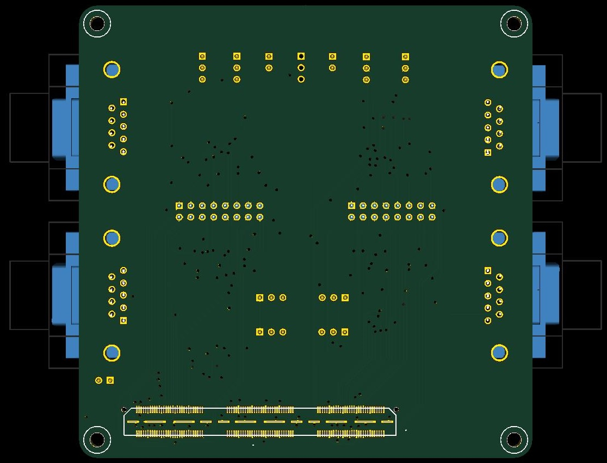

Copyright (c) 2014 Benjamin Vernoux, bvernoux@gmail.com

These files are part of Daisho (based on rs232 board).

License
=======

This is a free hardware design; you can redistribute it and/or modify
it under the terms of the GNU General Public License as published by
the Free Software Foundation; either version 2, or (at your option)
any later version.

This design is distributed in the hope that it will be useful,
but WITHOUT ANY WARRANTY; without even the implied warranty of
MERCHANTABILITY or FITNESS FOR A PARTICULAR PURPOSE.  See the
GNU General Public License for more details.

You should have received a copy of the GNU General Public License
along with this design; see the file COPYING.  If not, write to
the Free Software Foundation, Inc., 51 Franklin Street,
Boston, MA 02110-1301, USA.

Hardware Notes
==============

Schematic and layout files were designed in KiCad (release 2013-05-09
bzr 4147 -testing), an open source electronic design automation package.

This board is intended to be connected to Daisho Mother Board and have 4 RS232 links.

For more details on the board and functions see daisho_rs232_front_end_design.pdf or daisho_rs232_front_end_design.ods

See also pictures of the board:

